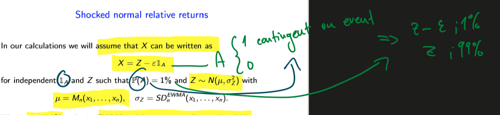
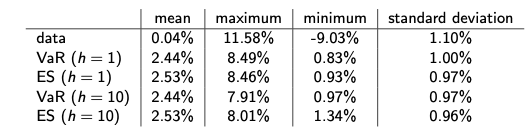

# 2. Probability theory overview

## Distributions


**The Bernoulli distribution **

$\operatorname{Ber}(p)$ with $0 \leq p \leq 1$ :
$$
F(x)=(1-p) \mathbb{1}_{[0, \infty)}(x)+p \mathbb{1}_{[1, \infty)}(x)
$$
**The binomial distribution** $\operatorname{Bin}(n, p)$ with $n \in \mathbb{N}, 0 \leq p \leq 1$
$$
F(x)=\sum_{k=0}^{n} \frac{n !}{k !(n-k) !} p^{k}(1-p)^{n-k} \mathbb{1}_{[k, \infty)}(x)
$$
For later use we set for every $m \in\{0, \ldots, n\}$
$$
\beta_{m}(n, p):=\sum_{k=0}^{m} \frac{n !}{k !(n-k) !} p^{k}(1-p)^{n-k}
$$
Note that $\operatorname{Ber}(p)=\operatorname{Bin}(1, p)$
--

The **uniform distribution** $U(a, b)$ with $a<b$ :
$$
F(x)=\mathbb{1}_{[a, b]}(x) \frac{x-a}{b-a}+\mathbb{1}_{(b, \infty)}(x)
$$
The **normal or Gaussian distribution** $N\left(\mu, \sigma^{2}\right)$ with $\mu \in \mathbb{R}, \sigma>0$ :
$$
F(x)=\Phi\left(\frac{x-\mu}{\sigma}\right), \quad \Phi(x)=\frac{1}{\sqrt{2 \pi}} \int_{-\infty}^{x} e^{-\frac{1}{2} y^{2}} d y
$$
The $\mathrm{t}$ or **Student distribution** $t\left(n, \mu, \sigma^{2}\right)$ for $n \in \mathbb{N} \backslash\{1\}, \mu \in \mathbb{R}, \sigma>0$ :
$$
F(x)=\Phi_{n}\left(\frac{x-\mu}{\sigma}\right), \quad \Phi_{n}(x)=\frac{\Gamma\left(\frac{n+1}{2}\right)}{\sqrt{n \pi} \Gamma\left(\frac{n}{2}\right)} \int_{-\infty}^{x}\left(1+\frac{y^{2}}{n}\right)^{-\frac{n+1}{2}} \mathrm{~d} y
$$
where $\Gamma$ is the Euler function defined for $a \in \mathbb{R}$ with $a>0$ by
$$
\Gamma(a)=\int_{0}^{\infty} z^{a-1} e^{-z} \mathrm{~d} z
$$

**The exponential distribution** $\operatorname{Exp}(\lambda)$ with $\lambda>0$ :
$$
F(x)=\mathbb{1}_{[0, \infty)}(x)\left(1-e^{-\lambda x}\right)
$$
**The lognormal distribution** $\log N\left(\mu, \sigma^{2}\right)$ with $\mu \in \mathbb{R}, \sigma>0$ :
$$
F(x)=\mathbb{1}_{(0, \infty)}(x) \Phi\left(\frac{\log (x)-\mu}{\sigma}\right)
$$
**The Pareto distribution** $\operatorname{Par}(\theta)$ with $\theta>0$ :
$$
F(x)=\mathbb{1}_{[0, \infty)}(x)\left(1-(1+x)^{-\theta}\right)
$$


## Mean variance


Definition. Let $X \in \mathcal{X}$. (If well-defined) The **mean** of $X$ is given by
$$
E(X):=\int_{\Omega} X \mathrm{~d} P=\int_{-\infty}^{\infty} x \mathrm{~d} F_{X}(x)
$$
The **variance** of $X$ is defined by
$$
\operatorname{var}(X):=\int_{\Omega}(X-E(X))^{2} \mathrm{~d} P=\int_{-\infty}^{\infty}(x-E(X))^{2} \mathrm{~d} F_{X}(x)
$$


### Mean and variance examples


## Quantiles

Proposition. For all $X \in \mathcal{X}$ and $\alpha \in(0,1)$ the following are equivalent:
(1) For all $x, y \in \mathbb{R}$ with $F_{x}(x)=F_{X}(y)=\alpha$ we have $x=y$.
$$
\text { (2) } q_{\alpha}^{-}(X)=q_{\alpha}^{+}(X)
$$
Interpretation. The lower and upper $\alpha$ -quantiles are distinct only when the distribution function of $X$ is flat at the level $\alpha$.
Corollary. Let $X \in \mathcal{X}$ and $\alpha \in(0,1)$. If $F_{X}$ is strictly increasing and continuous in a neighborhood of $x \in \mathbb{R}$ with $F_{X}(x)=\alpha,$ then
$$
q_{\alpha}^{-}(X)=q_{\alpha}^{+}(X)=F_{X}^{-1}(\alpha)
$$


### Examples of quantiles


 $$
\begin{array}{c|c} 
& q_{\alpha}^{-}(X)=q_{\alpha}^{+}(X) \\
\hline U(a, b) & (1-\alpha) a+\alpha b \\
\hline N\left(\mu, \sigma^{2}\right) & \mu+\Phi^{-1}(\alpha) \sigma \\
\hline t\left(n, \mu, \sigma^{2}\right) & \mu+\Phi_{n}^{-1}(\alpha) \sigma \\
\hline \operatorname{Exp}(\lambda) & -\frac{1}{\lambda} \log (1-\alpha) \\
\hline \log N\left(\mu, \sigma^{2}\right) & e^{\mu+\Phi^{-1}(\alpha) \sigma} \\
\hline \operatorname{Par}(\theta) & (1-\alpha)^{-\frac{1}{\theta}}-1 \\
\end{array}
$$


## Correlation

Definition. Let $X \in \mathcal{X}^{2}$ and assume neither $X_{1}$ nor $X_{2}$ is null. (If well-defined) The correlation between $X_{1}$ and $X_{2}$ is given by
$$
\operatorname{cor}\left(X_{1}, X_{2}\right):=\frac{E\left(X_{1} X_{2}\right)-E\left(X_{1}\right) E\left(X_{2}\right)}{\sqrt{\operatorname{var}\left(X_{1}\right) \operatorname{var}\left(X_{2}\right)}}
$$
**Correlation provides an indication about linear dependence**. Two RV can be uncorrelated and yet display strong nonlinear dependence!

# 3. Capital adequacy

$\Omega$ = set of all future *market scenarios*  
$\mathcal{F}$ = set of all observable *market events*  
P = historical probability  

A = aggregate value of assets  
L = aggregate value of liabiliites  
X = RV, net capital, where X = A - L  

For every terminal scenario $\omega \epsilon \Omega$, we have:  
$$X(\omega)=A(\omega)-L(\omega)$$


## Two main take-homes:

- **How to determine whether a company is adequately capitalized**
- **What to do if not**

**Variance** is unsifficient risk measure for CARM, because it doesn't tell what to do in case of inadequacy.


The higher the figure $\rho_A(X)$:  
- the more costly to reach acceptability
- the riskier position X

### Acceptance set
allows us to define **capital adequacy tests**

# Examples of risk measures

## Value at Risk (VaR)

Definition. Let $\alpha \in(0,1)$. The Value at Risk (VaR) at level $\alpha$ is defined by
$$
\operatorname{VaR}_{\alpha}(X):=-q_{\alpha}^{+}(X)
$$
where $-q_{\alpha}^{+}(X)\Rightarrow$ upper last quantile

### Interpretation

The quantity $\operatorname{VaR}_{\alpha}(X)$ is the **worst realization of X that may occur in the $100(1-\alpha)%$ cases**. Alpha is close to zero IRL, between 0.005-0.05.  

**Easy one** : VaR is the **worst** outcome of the $100(1-\alpha)%$ best cases. That is precisely the the q.


It tells us, how much capital to inject into X in order to **ensure that default prob does not exceed alpha**.


### Pitfalls

- in discrete cases, the level might not be the worst cases
- because the way it is defined, it might not be the maximum loss- it can be also a profit.

### Operational interpretation

$VaR_\alpha(X)$ represent the **smallest amount of capital** that has to be injected into X to **ensure that default prob. does not exceed level $\alpha$ $ 

## Expected shortfall

$$
\operatorname{ES}_{\alpha}(X):=\frac{1}{\alpha} \int_{0}^{\alpha} \operatorname{VaR}_{p}(X) \mathrm{d} p
$$

### Interpretation

ES takes all VaR quantiles left of a given quantile and then normalizes is by $\alpha$ . 

### Operational interpretation

Recurring description: Acceptance set is such set, which has negative ES (because ES is itself negative, - times - = +)

**ES can be interpreted as the smallest amount of capital that has to be injected into X to ensure NO DEFAULTS occur on average in the tail beyond the upper $\alpha$-quantile of X.** $\Rightarrow$ company is AQ under ES at level $\alpha$ if it is solvent on average over the tail beyond the upper $\alpha$-quantile.

*Alternative name* - average value at risk

### Question - How to choose $\alpha$ ?

With calibration. There is no a-priori theory, usually is set to app. 0.025. In regulation, it is prescribed to 0.01.

## Worst-case risk measures

Definition. Let $A \in \mathcal{F}$. The worst-case risk measure based on $A$ is defined by
$$
\mathrm{WC}_{A}(X):=\inf \{m \in \mathbb{R} ; m \geq-X \text { on } A\}
$$

### Interpretation

WC can be interpretated as the best realization of *-X* over the event A, or up to a sign as the worst realization of X over the event A.


### Operational interpretation

Smallest amount of capital injected into X in order to ensure that NO DEFAULTS occur in the scenarios belonging to A. $\Rightarrow$ company is adequately capitalized based on A if it solvent in each of the test scenarios prescribed by A.

## Loss Value at Risk

Definition. Let $\lambda:(-\infty, 0] \rightarrow(0,1)$ be increasing. The Loss Value at Risk (LVaR) at level $\lambda$ is defined by
$$
\operatorname{LVaR}_{\lambda}(X):=\sup _{x<0}\left\{\operatorname{VaR}_{\lambda(x)}(X-x)\right\}
$$

*sup = supremum, i.e. highest value

### Interpretation

The parameter x is loss level. For each x we apply VaR to the transformed cap. position X-x, we let the prob. level $\lambda$(x) depend on the loss size. Monotonicity ensure highers loss = lower prob. LVaR is the most conservative. It is generalization of Var. If $\lambda$=$\alpha$, we get VaR.

### Operational interpretation

Smallest amount of cap. that has to be injected into X that for every loss threshold x, prob. of incurring a default beyond size x does not exceed the level $\lambda$(x).

VaR controls only for prob. of default, LVaR controls for prob. of losing some specific value.

## Range Value at Risk

Definition. Let $0<\alpha<\beta<1$. The Range Value at Risk (RVaR) at levels $\alpha$ and $\beta$ is defined by
$$
\operatorname{RVaR}_{\alpha, \beta}(X):=\frac{1}{\beta-\alpha} \int_{\alpha}^{\beta} \operatorname{VaR}_{p}(X) \mathrm{d} p
$$

### Interpretation

$\operatorname{RVaR}_{\alpha, \beta}(X)$ can be interpreted, up to a sign, as a kind of average realization of $X$ among all the realizations that are contained between $q_{\alpha}^{+}(X)$ and $q_{\beta}^{+}(X)$


**We take the cut range, because at extreme ends, we have no data**

# 4. and 5. Properties of Risk Measures

**Main take home**: keep in mind what is a apt risk measure for CA

$$
\begin{array}{r}
X+m \notin \mathcal{A} \text { for every } m \in \mathbb{R}, \text { in which case we have } \\
\rho_{\mathcal{A}}(X)=\infty . \text { \} We have such a position that } \\
\text { injection of any finite avount is insufficient}
\end{array}
$$

Proposition. Let $X \in \mathcal{X}$. For all $0<\alpha<\beta<1$ we have
- $\operatorname{VaR}_{\alpha}(X)$ is always finite.
- $\operatorname{RVaR}_{\alpha, \beta}(X)$ is always finite.
- $\mathrm{ES}_{\alpha}(X)>-\infty$
- $\mathrm{ES}_{\alpha}(X)<\infty$ if and only if $\mathbb{E}(\min (X, 0))>-\infty$. - consider only the negative amounts and check, whether it's finite or not

## Impact of capital injections

**KEY PROPERTY** $\rho_{\mathcal{A}}$ satisfies the following cash-additivity property:
$$
\rho_{\mathcal{A}}(X+m)=\rho_{\mathcal{A}}(X)-m
$$

*Interpretation*: Cap. injections decrease cap. req. in a linear way $\Rightarrow$ cap. test are some defnites as **target capital**

$X_0 = \text{avalaible capital} \geq \text{target capital} = \rho_A(X-X_0)$

where $X_{0}$ is capital at time 0 . Indeed, by cash additivity, we have
$$
X \in \mathcal{A} \Longleftrightarrow \rho_{\mathcal{A}}(X) \leq 0 \Longleftrightarrow X_{0} \geq \rho_{\mathcal{A}}\left(X-X_{0}\right)
$$

### Monotonicty 

$$
X \in \mathcal{A}, Y \geq X \Longrightarrow Y \in \mathcal{A}
$$

If company A has more capital than company B, which is adeq. cap., than A is also adeq. cap. Important for holdings, consolidation, etc.

### Stability under scaling

We say that $\mathcal{A}$ is stable under scaling whenever
$$
X \in \mathcal{A}, a \in[0, \infty) \Longrightarrow a X \in \mathcal{A}
$$

Stab. under scaling means acceptability is **independent of the size** od the cap. positions.

!! LVaR is NOT homogenous, scaling doesnt work for it.

### Stability under aggregation

If two positions are independtly adeq. cap., than their sum is also adeq. cap. Again important for consolidation, subsidiaries etc.

$\rho_A(X+Y)\leq\rho_A(X)+\rho_A(Y)$

The $\leq$ sign, meaning sometimes two positions aggregated yield an "overcapitalized" positions, meaning:
- **incentivizes** aggregation (always true)
- **implied** diversification (if certain assumption are full-filled - they have to be i.i.d)

#### Three main implications:

- sum of cap. req. of indi. subposition is conservative proxy for the cap. req. of the agg. position (challenging to estimate)
- CA can be enforec in a decentralized way
- no incentive to break up balance sheet

Following risk measures are (not) subadditive:

- VaR: NO
- ES: YES
- WC: YES
- LVaR: NO
- RVaR: NO

### Coherence

**We say that $\mathcal{A}$ is COHERENT iff it's BOTH stable under scaling AND aggregation**.

Following risk measures are (not) coherent

- VaR: NO
- ES: YES
- WC: YES
- LVaR: NO
- RVaR: NO

!!! Careful:

If we have a fully-leveraged positions (zero-cost LS portfolio e.g.), we accumulate **loss peaks in the tail**, but because of subaddivity, the position even improves CA.

# 6. Tail risks

## Sensitivity to tail risk

### Definition

$$
\begin{aligned}
&\text { Definition. We say that } \mathcal{A} \text { is sensitive to tail risk whenever }\\
&X \in \mathcal{X}, \mathbb{P}(E)>0 \Rightarrow X-a \mathbb{1}_{E} \notin \mathcal{A} \text { for } a \in(0, \infty) \text { large enough. }
\end{aligned}
$$


### Interpretation

If $\mathcal{A}$ is sensitivity to tail risk, a large accum. of loss peaks will always result in a positive cap. req.
There risk measures are sensitive to tail risk: 

- VaR: NO
- ES: YES
- WC: NO
- LVaR: NO
- RVaR: NO

ONLY *ES* is sensitivity to tail risks!!


## Acceptability and distributions

We say that $\mathcal{A}$ is law invariant whenever
$$
X \in \mathcal{A}, F_{Y}=F_{X} \Longrightarrow Y \in \mathcal{A}
$$

### Interpretation

Law invariance says that acceptability depends only on the **probability distribution** of a  capital position. Meaning we can use statistical estimation to compute capital requirements.

# 7. Surplus and default profiles

- shareholders' surplus: random var, $S_x=max(X,0) = max(A -L,0)$ : what is extra from the acc. set, shareholders' payoff
- shareholders' default option, $D_x=-min(X,0) = max(-X,0) = max(L-A,0)$ : incorporates the limited liability.If L-A is negative, meaning there is less cash than liabilities to satisfy them, creditors get 0 (max condition) and can suck it

#### For every capital positiion we have X=Sx-Dx

## Protection of liability holders

Definition. We say that $\mathcal{A}$ is surplus invariant if
$$
X \in \mathcal{A}, D_{Y} \leq D_{X} \Longrightarrow Y \in \mathcal{A}
$$

### Interpretation

Surplus invariance = company whose default option is smaller than of an acceptable company, it's also acceptable.

## Surplus invariance

Proposition. For every acceptance set $\mathcal{A}$ the following are equivalent:
- For every capital position $X \in \mathcal{X}$ we have
$$
X \in \mathcal{A} \Longleftrightarrow-D_{x}=\min (X, 0) \in \mathcal{A}
$$
$\mathcal{A}$ is surplus invariant.
Interpretation. The outcome of a surplus-invariant capital adequacy test is independent of (the size of) the surplus and is only driven by the default profile.


# Summary (SUPER IMPORTANT)


# Review of Statistics

## Statistical inference 

The basic goal of statistical inference is to provide **assesments about the PD that is assumed to have "generated" the sample**. Basically, we infer some characteristics from the sample distribution, which should have generated the sample and assume those characteristics are to remain constant and keep generating sample subject to the underlying rules and mechanics.

Standard assumption is the sample is i.i.d., even though it might not be necessarily true.

## Statistics (backtesting through hypothesis testing)

Definition. Let $\Theta$ be a set. Any function $S_{n}: \mathbb{R}^{n} \rightarrow \Theta$ is called $d$ statistic. We say that $S_{n}$ is a
- (point) estimator if $\Theta$ consists of points in $\mathbb{R}^{k}$.
- interval/region estimator if $\Theta$ consists of subsets of $\mathbb{R}^{k}$.
- test statistic if $\Theta$ contains two elements.
- rank statistic if $\Theta$ is finite and contains more than two elements.

### Interpretation:

the set $\Theta$ (statistic) consists of **model parameters** (mean, variance) or **decision parameters** ("accept, reject").

A statistic gives us a **rule to link the data with a specific model parameter or decision variable**

Example. Let $\Theta=\mathbb{R}$. The statistic $M_{n}: \mathbb{R}^{n} \rightarrow \Theta$ given by
$$
M_{n}\left(x_{1}, \ldots, x_{n}\right):=\frac{1}{n} \sum_{i=1}^{n} x_{i}
$$
is called the sample mean.
Example. Let $\Theta=[0, \infty)$. The statistic $V_{n}: \mathbb{R}^{n} \rightarrow \Theta$ given by $($ for $n>1$ )
$$
V_{n}\left(x_{1}, \ldots, x_{n}\right):=\frac{1}{n-1} \sum_{i=1}^{n}\left(x_{i}-\frac{1}{n} \sum_{i=1}^{n} x_{i}\right)^{2}
$$
is called the sample variance.

# Statistical Estimation of VaR and ES

## Algoritm for estimation


### The estimation problem

(6) Make assumptions about the link 

- **unconditional approach**: the random variables X1 .... Xn and X are assumed to be **independent and identically distributed**
- **conditional approach**: the random vars are assumed to be *dependent* and to display different distributions

(8) Choice of the sample size is crucial:

- **small sample size**: the RM statistics may be very volatile and hence encentivize too frequent portfolio rebalancing
- **large sample size**: the RM statistics may be too slow to react to losses or incorporate different volatility clusters

## From CA to PM

we do not have data about capital position of a financial institution.

We consider $$X = \text{portfolio's return}$$

$$
\begin{array}{l}
\text { Proposition. Let } \rho=\operatorname{VaR}_{\alpha} \text { or } \rho=\mathrm{ES}_{\alpha} \text { for some } \alpha \in(0,1) \text { . }\\
\rho\left(\frac{V_{1}-V_{0}}{V_{0}}\right)=\frac{\rho\left(V_{1}-V_{0}\right)}{V_{0}} .\\
\rho\left(\frac{V_{1}}{V_{0}}\right)=\frac{\rho\left(V_{1}-V_{0}\right)}{V_{0}}-1 .
\end{array}
$$


### Interpretation:

Quantity $\rho(V1-V0)$ is the capital to be injected to ensure we have a profit V1>V0 at an acceptable level of confidence


# Estimation setting

```{r}
library ( zoo )
library ( pdfetch )
library (ggplot2)
data = pdfetch_YAHOO("^GSPC", fields="close", from="1990-01-01", to= "2019-12-31")
price = coredata ( data ) #very similar to xlsread, coredata takes only the
x = diff ( price )/ price [1:( length ( price ) -1)]


time = index ( data )
t = time [2: length ( time )]
plot (t ,x , type ="l" , xlab ="Relative returns" , ylab = "", main="S&P500 Relative Returns")

```

```{r}
hVaR = function (x , alpha ){
n = length (x)
k = floor (n* alpha )
r = - sort (x )[ k +1]
return ( r)
}
compute_hVaR = function (x ,n , alpha ){
N = length (x)- n +1
r = rep (0 , N)
for (i in 1: N ){
r[i ] = hVaR (x[ i :( i+n -1)] , alpha )
}
return ( r)
}
# % x is the time series of our relative returns
hVarOutput = compute_hVaR (x ,250 ,0.01)
```


```{r}
hES = function (x , alpha ){
n = length (x)
k = floor (n* alpha )
r = - sum ( sort ( x )[1: k ]) / (n* alpha )- sort ( x )[ k +1] *( alpha -k/n )/ alpha
return ( r)
}
compute_hES = function (x ,n , alpha ){
N = length (x)- n +1
r = rep (0 , N)
for (i in 1: N ){
r[i ] = hES (x[i :( i+n -1)] , alpha )
}
return ( r)
}
#% x is the time series of ou
hESOutput = compute_hES(x ,250 ,0.025)

date = t[1:length(hESOutput)]

x = diff ( price )/ price [1:( length ( price ) -1)]
b = length(x)
for (i in 1 : b) {
  if (x[i] < 0) {
    x[i] = abs(x[i])}
    else {
      x[i] = 0
      }
    }
x = x[1:length(hESOutput)] 
              
df = data.frame(date,hVarOutput,hESOutput,x)
ggplot(df, aes(date)) +    
  geom_col(aes(y = x), color = "gray") +# basic graphical object
  geom_line(aes(y=hVarOutput), colour="black") +  # first layer
  geom_line(aes(y=hESOutput), colour="red") #second layer
  

```

# Estimatoin of VaR and ES - The Weighted Historical Approach 

## The weighted sample distribution function

Definition. Let $x \in \mathbb{R}^{n}$ and consider a vector $\boldsymbol{\pi}=\left(\pi\left(x_{1}\right), \ldots, \pi\left(x_{n}\right)\right) \in \mathbb{R}^{n}$
satisfying:
$\pi\left(x_{1}\right), \ldots, \pi\left(x_{n}\right) \in(0,1)$
$\sum_{i=1}^{n} \pi\left(x_{i}\right)=1$
The weighted sample distribution function associated with $x$ and $\pi$ is the distribution function $F_{x, \pi} \in \mathcal{D}$ given by
$$
F_{x, \pi}(x):=\sum_{i=1}^{n} \pi\left(x_{i}\right) \mathbb{1}_{\left[x_{i}, \infty\right)}(x) .
$$

### Interpretation 

The sample distribution is a step-wise function constructed by **weighing past observations through the (probability) weights $\pi(x_{1...n})$. It is a probability


For every $\alpha \in(0,1)$ we define the index
$$
k(\alpha, \pi):=\min \left\{k \in\{1, \ldots, n\} ; \sum_{i=1}^{k} \pi\left(x_{i: n}\right)>\alpha\right\}-1 .
$$


Weighted historical estimators. The weighted historical VaR is given by

$$
\operatorname{VaR}_{n, \alpha}\left(x_{1}, \ldots, x_{n}\right)=-x_{k(\alpha, \pi)+1: n}
$$
The weighted historical ES is given by
$\mathrm{ES}_{n, \alpha}\left(x_{1}, \ldots, x_{n}\right)=-\frac{1}{\alpha} \sum_{i=1}^{k(\alpha, \pi)} \pi\left(x_{i: n}\right) x_{i: n}-\frac{\alpha-\sum_{i=1}^{k(\alpha, \pi)} \pi\left(x_{i: n}\right)}{\alpha} x_{k(\alpha, \pi)+1: n}$

### Interpretation:

The weighted historical VaR and ES coincide with the VaR and ES of the weighted sample distribution function

### Setting probability weights

```{r}
pweights = function ( lambda ){
i = 1:250
pi = lambda ^(250 - i )* (1 - lambda )/ (1 - lambda ^250)
return(pi)
}
```

### Compute historical weighted Var

```{r}
wVaR = function (x , lambda , alpha ){
pi = pweights ( lambda )
k = min ( which ( cumsum ( pi [ order (x )]) > alpha )) -1
r = - sort (x )[ k +1]
return ( r)
}
hold4 = compute_wVaR = function (x ,n , lambda , alpha ){
N = length (x)- n +1
r = rep (0 , N)
for (i in 1: N ){
r[i ] = wVaR (x[ i :( i+n -1)] , lambda , alpha )
}
return ( r)
}
#% x is the time series of our relative returns
hold1 = compute_wVaR(x ,250 ,0.99 ,0.01)
hold2 = compute_wVaR(x ,250 ,0.98 ,0.01)
```

### Historical weighted ES

```{r}
wES = function (x , lambda , alpha ){
pi = pweights ( lambda )
q = pi [ order (x )]
k = min ( which ( cumsum (q) > alpha )) -1
r1 = (k ==0) * sort (x )[ k +1]
r2 = (k >0) *( sum ( sort (x )[1: k ]*q [1: k ])+ sort (x )[ k +1] * ( alpha - sum (q [1: k ])))
r = -( r1 + r2 )/ alpha
return ( r)
}
holder3 = compute_wES = function (x ,n , lambda , alpha ){
N = length (x)- n +1
r = rep (0 , N)
for (i in 1: N ){
r[i ] = wES (x[i :( i+n -1)] , lambda , alpha )
}
return ( r)
}
#% x is the time series of our relative returns
holder = compute_wES(x ,250 ,0.99 ,0.025)
holder2 = compute_wES(x ,250 ,0.98 ,0.025)

```


$$
\begin{array}{l|c|c|c|c} 
& \text { mean } & \text { maximum } & \text { minimum } & \text { standard deviation } \\
\hline \text { data } & 0.04 \% & 11.58 \% & -9.03 \% & 1.10 \% \\
\text { VaR }(\lambda=0.99) & 2.62 \% & 9.03 \% & 0.94 \% & 1.34 \% \\
\text { ES }(\lambda=0.99) & 2.62 \% & 8.93 \% & 1.05 \% & 1.27 \% \\
\text { VaR }(\lambda=0.98) & 2.54 \% & 9.03 \% & 0.76 \% & 1.35 \% \\
\text { ES }(\lambda=0.98) & 2.51 \% & 8.99 \% & 0.81 \% & 1.26 \%
\end{array}
$$


# Estimation of VaR and ES: The Risk Metrics Approach

## VaR and ES under normality


Let $\Phi$ be the distribution function of a standard normal random variable, i.e.
$$
\Phi(x):=\frac{1}{\sqrt{2 \pi}} \int_{-\infty}^{x} e^{-\frac{1}{2} y^{2}} \mathrm{~d} y
$$
Proposition. Let $X \sim N\left(\mu, \sigma^{2}\right) .$ Then, for every $\alpha \in(0,1)$ we have:
- $\operatorname{VaR}_{\alpha}(X)=-\mu-\sigma \Phi^{-1}(\alpha)$
- $\operatorname{ES}_{\alpha}(X)=-\mu+\frac{\sigma}{\alpha} \Phi^{\prime}\left(\Phi^{-1}(\alpha)\right)$


## Estimating mean and variance

Definition. For a given $\lambda>0$, the EWMA variance is defined by
$$
V_{n}^{E W M A}\left(x_{1}, \ldots, x_{n}\right):=(1-\lambda) \sum_{i=1}^{n} \lambda^{n-i}\left(x_{i}-M_{n}\left(x_{1}, \ldots, x_{n}\right)\right)^{2}
$$
or recursively by
$$
\left\{\begin{array}{l}
V_{1}^{E W M A}\left(x_{1}\right)=(1-\lambda)\left(x_{1}-M_{n}\left(x_{1}, \ldots, x_{n}\right)\right)^{2} \\
V_{2}^{E W M A}\left(x_{1}, x_{2}\right)=\lambda V_{1}^{E W M A}\left(x_{1}\right)+(1-\lambda)\left(x_{2}-M_{n}\left(x_{1}, \ldots, x_{n}\right)\right)^{2} \\
\cdots \\
V_{n}^{E W M A}\left(x_{1}, \ldots, x_{n}\right)=\lambda V_{n-1}^{E W M A}\left(x_{1}, \ldots, x_{n-1}\right)+(1-\lambda)\left(x_{n}-M_{n}\left(x_{1}, \ldots, x_{n}\right)\right)^{2}
\end{array}\right.
$$


The EWMA standard deviation is given by
$$
S D_{n}^{E W M A}\left(x_{1}, \ldots, x_{n}\right):=\sqrt{V_{n}^{E W M A}\left(x_{1}, \ldots, x_{n}\right)}
$$
Interpretation. The acronym EWMA stands for exponential weighted moving average. This is akin to the variance in an (I)GARCH model (see Lecture 10).


We define variance by (as above)

$$
V_{n}^{E W M A}\left(x_{1}, \ldots, x_{n}\right):=(1-\lambda) \sum_{i=1}^{n} \lambda^{n-i}\left(x_{i}-M_{n}\left(x_{1}, \ldots, x_{n}\right)\right)^{2}
$$

Lambda is usually .99 or .98. Interpretation: the older the observation is (lower i), the less weight it gives into the EWMA (given by $\lambda^{n-i}$) and thus receives less importance


### Setting EWMA weights

```{r}
EWMAweights = function(lambda){ i = 1:250
pi = (1-lambda)*lambda^(250-i) 
return(pi)
}
```

### Computing VaR in Risk Metrics Approach

```{r}
rmVaR = function(x,lambda,alpha){
n = length(x)
m = sum(x)/n
sd = sqrt(sum(EWMAweights(lambda)*(x-m)^2)) 
q = qnorm(alpha ,0,1)
r = -m-sd*q
return(r)
}
```

### Computing ES in Risk Metrics Approach

```{r}
compute_rmVaR = function(x,n,lambda,alpha){ N = length(x)-n+1
r = rep(0,N)
for (i in 1:N){
r[i] = rmVaR(x[i:(i+n-1)],lambda ,alpha)
}
return(r)
}
# x is the time series of our relative returns compute_rmVaR(x,250,0.99,0.01) compute_rmVaR(x,250,0.97,0.01)
```


# Estimation of VaR and ES: Simulation Approach

## Generating distribution using quantiles

Proposition. Let $U \sim U(0,1)$. For every $F \in \mathcal{D}$ define the random variable
$$
q_{U}^{+}(F):=\inf \{x \in \mathbb{R} ; F(x)>U\} \stackrel{F \text { invertible }}{=} F^{-1}(U)
$$
Then, we have
$$
q_{U}^{+}(F) \sim F
$$

This process is called **"quantile inversion"**

Idea: By taking (upper) quantile of a DF F to a uniform random variable, we obtain a random variable with the same distribution F.

That shows that if we want to simulate realizations of a random variable with distribution F, it suffices to apply the upper quantile of F to simulated realizations of a uniform random variable.

## The simulation approach

The idea is that if we have a set of reutrns Z, even if we konw their distribution, it's no trivial to know distribution of the whole set X. That is why we combine them with *f*, the DF from before.

### Algorithm 

The simulation approach is based on the following steps:
- Let $h \in \mathbb{N}$ (number of iterations) and $s \in \mathbb{N}$ (number of simulations per iteration).
- For every $k \in\{1, \ldots, h\}$ let $u_{1}^{k}, \ldots, u_{m s}^{k}$ be realizations of independent uniform random variables on $(0,1)$.
- For every $j \in\{1, \ldots, m\}$ and $i \in\{1, \ldots, s\}$ set
$$
z_{i}^{k, j}=q_{u_{j-1) s+i}^{k}}^{+}\left(Z^{j}\right)
$$
- For every $i \in\{1, \ldots, s\}$ set
$$
x_{i}^{k}=f\left(z_{i}^{k, 1}, \ldots, z_{i}^{k, m}\right) .
$$
Remark. Note that we have to ensure independence also across the different iterations.

Then we perform VaR and ES for each iteration *h* and average across all iterations.

#### Shocked normal relative returns



We set $\varepsilon = 2.5%$ and take EWMA weights corresponding to $\lambda = .99$. 

Interpretation: We assume that X follows a normal distr. subject to external shocks with probability 1%. The shock lowers relative returns by *2.5%*. Note that X is not normal.

### Simulation VaR

```{r}

simVaR = function(x,h,s,lambda,alpha){
m = sum(x)/length(x)
sd = sqrt(sum(EWMAweights(lambda)*(x-m)^2))
hr = rep(0,h)
u = runif(2*s*h)
sim_z = qnorm(u[1:(s*h)],m,sd)
sim_ind = qbinom(u[(s*h+1):(2*s*h)],1,0.01)

for (k in 1:h){
z = sim_z[((k-1)*s+1):(k*s)]
ind = sim_ind[((k-1)*s+1):(k*s)]
x = z-0.025*ind
hr[k] = hVaR(x,alpha)
}
r = sum(hr)/h

return(r)
}
compute_simVaR = function(x,n,h,s,lambda,alpha){ N = length(x)-n+1
r = rep(0,N)
for (i in 1:N){
r[i] = simVaR(x[i:(i+n-1)],h,s,lambda ,alpha)
}
return(r)
} # x is the time series of our relative returns compute_simVaR(x,250,1,500,0.99,0.01)
 simulatedVaR = compute_simVaR(x,250,10,500,0.99,0.01)
```

```{r}
simES = function(x,h,s,lambda,alpha){
m = sum(x)/length(x)
sd = sqrt(sum(EWMAweights(lambda)*(x-m)^2))
hr = rep(0,h)
u = runif(2*s*h)
sim_z = qnorm(u[1:(s*h)],m,sd)
sim_ind = qbinom(u[(s*h+1):(2*s*h)],1,0.01)
for (k in 1:h){
z = sim_z[((k-1)*s+1):(k*s)]
ind = sim_ind[((k-1)*s+1):(k*s)]
x = z-0.025*ind
hr[k] = hES(x,alpha)
}
r = sum(hr)/h
return(r)
}
compute_simES = function(x,n,h,s,lambda,alpha){ N = length(x)-n+1
r = rep(0,N)
for (i in 1:N){
r[i] = simES(x[i:(i+n-1)],h,s,lambda ,alpha)
}
return(r)
}   #% x is the time series of our relative returns 
simES1 = compute_simES(x,250,1,500,0.99,0.025) 
simES2 = compute_simES(x,250,10,500,0.99,0.025)
```




# Estimation VaR and ES - Conditional Approach

So far, we assumed i.i.d. Empirically we know wolatility clusters, so no good.

## Filtrations

Definition. An ( $n$ -dimensional) filtration is any sequence of $\sigma$ -fields
$$
\mathcal{F}=\left(\mathcal{F}_{1}, \ldots, \mathcal{F}_{n}\right)
$$
such that $\mathcal{F}_{1} \subset \cdots \subset \mathcal{F}_{n} .$ We always assume that $\mathcal{F}_{n} \subset \mathcal{F}$.

**Interpretation**: filtration models the *flow of information* - at each point in time we get new information and we want to discard some outcomes as impossible.

Definition. Let $X \in \mathcal{X}^{n}$ and consider an $n$ -dimensional filtration $\mathcal{F}$. We say that $X$ is $\mathcal{F}$ -adapted whenever $X_{i}$ is $\mathcal{F}_{i}$ -measurable for every $i \in\{1, \ldots, n\}$.

## The general time series model

Setup. Let $t \in \mathbb{Z}$ and take a filtration $\left(\mathcal{F}_{t}\right) .$ Set $X_{n+1}=X$ and assume that $X_{1}, \ldots, X_{n}, X_{n+1}$ are part of an $\left(\mathcal{F}_{t}\right)$ -adapted process $\left(X_{t}\right)$ such that
$$
X_{t}=\mu_{t}+\sigma_{t} Z_{t}
$$
where $\mu_{t}$ and $\sigma_{t}$ are $\mathcal{F}_{t-1-\text { measurable and }} U_{t}=\sigma_{t} \overline{Z_{t}}$ is the innovation term. We stipulate the following assumptions:
- the elements of $\left(Z_{t}\right)$ are independent
- the elements of $\left(Z_{t}\right)$ are identically distributed as $Z$
- $\mathbb{E}[Z]=0$ and $\operatorname{var}(Z)=1$
- $\sigma_{t}$ is strictly positive (almost surely)
Remark: The time series $\left(Z_{t}\right)$, with standardized i.i.d. elements and zero unconditional mean, is also known in time series analysis as **"white noise"** - that contains no information


## Maximum-Likelihood estimation

Definition. Let $t \in \mathbb{Z}$ and take a filtration $\left(\mathcal{F}_{t}\right)$. Consider an $\left(\mathcal{F}_{t}\right)$ -adapted process $\left(X_{t}\right)$ with joint density function $f_{\theta}\left(x_{1}, \ldots, x_{t}\right)$, with $\theta$ an unknown $1 \times p$ parameter vector. The likelihood function and log-likelihood function are defined respectively as
$$
\begin{array}{l}
L(\theta)=f_{\theta}\left(X_{1}, \ldots, X_{t}\right) \\
\ell(\theta)=\log \left(f_{\theta}\left(X_{1}, \ldots, X_{t}\right)\right)
\end{array}
$$
The maximum likelihood estimator (MLE) $\theta^{\text {MLE }}$ of $\theta$ is the maximizer of $\ell(\theta)$.

## Conditional VaR and ES


## Modeling AR, MA and ARMA models


### Choosing the model


## Modelling conditional heteroskedastic models

$$
\operatorname{var}\left(X_{t+1} \mid \mathcal{F}_{t}\right)=\operatorname{var}\left(X_{t+1}\right)=\sigma^{2}
$$

It conditional and unconditional variance is the same, it's called *conditional homoskedasticity*.

the elements of $\left(X_{t}\right)$ are serially uncorrelated but dependent, i.e. if we emove the 2nd "i" in i.i.d., their conditional variance is not constant anymore
$$
\operatorname{var}\left(X_{t+1} \mid \mathcal{F}_{t}\right)=\operatorname{var}\left(U_{t+1} \mid \mathcal{F}_{t}\right)=\mathbb{E}\left(U_{t+1}^{2} \mid \mathcal{F}_{t}\right)=\sigma_{t+1}^{2}
$$
This property is called conditional heteroskedasticity: the dependence across $X_{t}$ nakes the flow of information relevant to determine their variance, which varies ser time as new information becomes available.


## Risk Factor Mapping


Linearization is regression

### Delta VaR and ES

Definition. Let $\alpha \in(0,1)$ and set $X_{t}=\frac{V_{t}-V_{0}}{V_{0}} .$ The Delta VaR is given by
$$
\operatorname{VaR}_{\alpha}^{\Delta}\left(X_{t}\right):=\frac{1}{V_{0}} \operatorname{VaR}_{\alpha}\left(\sum_{i=1}^{m} \partial_{i} f\left(Z_{0}, 0\right)\left(Z_{t}^{i}-Z_{0}^{i}\right)+\partial_{m+1} f\left(Z_{0}, 0\right) t\right)
$$
Similarly, the Delta ES is given by
$$
\mathrm{ES}_{\alpha}^{\Delta}\left(X_{t}\right):=\frac{1}{V_{0}} \operatorname{ES}_{\alpha}\left(\sum_{i=1}^{m} \partial_{i} f\left(Z_{0}, 0\right)\left(Z_{t}^{i}-Z_{0}^{i}\right)+\partial_{m+1} f\left(Z_{0}, 0\right) t\right)
$$

Interpretaion: Delta approach is useful when risk factors can be estimated - we have a lot of data. Then we believe payoff of our position can be safely approximated in a linear way.

#### Delta VaR and ES under normal risk factors

Proposition. For $m \in \mathbb{N}$ let $\mu \in \mathbb{R}^{m}$ and $\sigma \in \mathbb{R}^{m \times m}$ be an invertible positive definite (symmetric) matrix. Then, for every $\boldsymbol{X}=\left(X_{1}, \ldots, X_{m}\right) \in \mathcal{X}^{m}$ the following statements are equivalent:
- $\sum_{i=1}^{m} a_{i} X_{i} \sim N\left(\sum_{i=1}^{m} a_{i}, \sum_{i, j=1}^{m} a_{i} a_{j} \sigma_{i j}\right)$ for every $a_{1}, \ldots, a_{m} \in \mathbb{R}$
- $\boldsymbol{X} \sim N^{m}(\boldsymbol{\mu}, \boldsymbol{\sigma})$

Proposition. Let $\mu \in \mathbb{R}^{m}$ and $\sigma \in \mathbb{R}^{m \times m}$ be an invertible positive definite (symmetric) matrix. Assume that $Z_{t}-Z_{0} \sim N^{m}(\mu, \sigma)$. Then, we have:

$$
\begin{array}{l}
\text { - } \operatorname{VaR}_{\alpha}^{\Delta}\left(X_{t}\right)=-\frac{1}{V_{0}}\left(\sum_{i=1}^{m} \partial_{i} f\left(Z_{0}, 0\right) \mu_{i}+\partial_{m+1} f\left(Z_{0}, 0\right) t\right)- \\
\frac{1}{V_{0}} \sqrt{\sum_{i, j=1}^{m} \partial_{i} f\left(Z_{0}, 0\right) \partial_{j} f\left(Z_{0}, 0\right) \sigma_{i j}} \phi^{-1}(\alpha) \\
\cdot \operatorname{ES}_{\alpha}^{\Delta}\left(X_{t}\right)=-\frac{1}{V_{0}}\left(\sum_{i=1}^{m} \partial_{i} f\left(Z_{0}, 0\right) \mu_{i}+\partial_{m+1} f\left(Z_{0}, 0\right) t\right)+ \\
\frac{1}{V_{0}} \sqrt{\sum_{i, j=1}^{m} \partial_{i} f\left(Z_{0}, 0\right) \partial_{j} f\left(Z_{0}, 0\right) \sigma_{i j}} \frac{\Phi^{\prime}\left(\Phi^{-1}(\alpha)\right)}{\alpha}
\end{array}
$$

### Estimating covariance

$$
\begin{array}{l}
\text { Definition. For a given } \lambda>0 \text { , the EWMA covariance is defined by }\\
C O V_{n}^{E W M A}(x, y):=(1-\lambda) \sum_{i=1}^{n} \lambda^{n-i}\left(x_{i}-M_{n}\left(x_{1}, \ldots, x_{n}\right)\right)\left(y_{i}-M_{n}\left(y_{1}, \ldots, y_{n}\right)\right)
\end{array}
$$

Risk Metrics estimators. The Risk Metrics VaR estimator is given by
$$
\operatorname{VaR}_{\alpha, n}:=-\frac{1}{v_{n}}\left(\sum_{i=1}^{m} \partial_{i} f\left(z_{n}, 0\right) M_{n}\left(z^{i}\right)+\partial_{m+1} f\left(z_{n}, 0\right)\right)-\frac{1}{v_{n}} \sqrt{\sum_{i, j=1}^{m} \partial_{i} f\left(z_{n}, 0\right) \partial_{j} f\left(z_{n}, 0\right) \operatorname{cov}_{n}^{E W M A}\left(z^{i}, z^{j}\right) \Phi^{-1}(\alpha)}$$

The Risk Metrics ES estimator is given by

$$
\mathrm{ES}_{\alpha, n}:=-\frac{1}{v_{n}}\left(\sum_{i=1}^{m} \partial_{i} f\left(z_{n}, 0\right) M_{n}\left(z^{i}\right)+\partial_{m+1} f\left(z_{n}, 0\right)\right)+\frac{1}{v_{n}} \sqrt{\sum_{i, j=1}^{m} \partial_{i} f\left(z_{n}, 0\right) \partial_{j} f\left(z_{n}, 0\right) \operatorname{cov}_{n}^{E W M A}\left(z^{i}, z^{j}\right)} \frac{\phi^{\prime}\left(\Phi^{-1}(\alpha)\right)}{\alpha}
$$
Interpretation: above esimators coincide with the Delta VaR and ES computed under the assumption that the risk factor changes are jointly normal

### Time conversoin rules

- if we want 1- day risk measure, we use daily data
- if we want 5-day RM, we use weekly

**Warning 1:** if chose horizon is too far, we have sparse data set. By doing so
- We hide loss peaks between consecutive data points 
- include data points not include

**Warning2:** If we have a multi-day risk measure using a rolling window, we have to roll the window according to the chosen horizon

Let $\alpha \in(0,1)$ and $0<s<t \leq T$. In this case
$\operatorname{VaR}_{\alpha}\left(X_{s}\right)$ is safer to estimate
- $\operatorname{VaR}_{\alpha}\left(X_{t}\right)$ is trickier to estimate
We ask whether we can express $\operatorname{VaR}_{\alpha}\left(X_{t}\right)$ in terms of $\operatorname{VaR}_{\alpha}\left(X_{s}\right)$ as in
$$
\operatorname{VaR}_{\alpha}\left(X_{t}\right)=f\left(\operatorname{VaR}_{\alpha}\left(X_{s}\right), s, t\right)
$$
In this case, we could rely on the estimation of $\operatorname{VaR}_{\alpha}\left(X_{s}\right)$ and derive the estimates of $\operatorname{VaR}_{\alpha}\left(X_{t}\right)$ by exploiting the above link.

Easy interpretation: if we want longer horizons, because of the time thing, we esimate a shorter, i.e. safer VaR and then transform it to longer horizon with the distribution. In practice, it is done by the square-root rule

#### Square root rule

Done in practice but impossible to prove mathematically. 


The square-root rule. Let $\alpha \in(0,1)$ and $0<s<t \leq T$. The square-root rule for VaR postulates that
$$
\operatorname{VaR}_{\alpha}\left(X_{t}\right)=\sqrt{\frac{t}{s}} \operatorname{VaR}_{\alpha}\left(X_{s}\right)
$$
The square-root rule for ES postulates that
$$
\mathrm{ES}_{\alpha}\left(X_{t}\right)=\sqrt{\frac{t}{s}} \mathrm{ES}_{\alpha}\left(X_{s}\right)
$$

## Overview


# Backtesting under VaR and ES
The term **backtesting** is a *process of assesing if ex-ante estimation are aligned with ex-post observations*.

## Model selection

Setup. Let $\rho: \mathcal{X} \rightarrow[-\infty, \infty]$ be a law-invariant risk measure. To perform model selection using $\rho$ one can do the following:
- Collect past observations $x_{1}, \ldots, x_{n}$.
- Use $x_{1}, \ldots, x_{n}$ to come up with competing models for $F_{X}$, say
$$
\hat{F}_{\left(x_{1}, \ldots, x_{n}\right)}^{(1)}, \ldots, \widehat{F}_{\left(x_{1}, \ldots, x_{n}\right)^{*}}^{(m)}
$$
- Compute the risk estimates $\rho\left(\widehat{F}_{\left(x_{1}, \ldots, x_{n}\right)}^{(1)}\right), \ldots, \rho\left(\widehat{F}_{\left(x_{1}, \ldots, x_{6}\right)}^{(m)}\right)$.
- Assume that $X$ materializes into $x$.
- We want to use $x$ to select the best model out of $\hat{F}_{\left(x_{1}, \ldots, x_{n}\right)}^{(1)}, \ldots, \hat{F}_{\left(x_{1}, \ldots, x_{n}\right)^{-}}^{(m)}$

By doing backtest for all models, we look which performs the best. More specifically, we are selecting our model **based on the performance of the risk measure $\rho$ .

**Question:** How to decide which model is better?

## Model validation

Setup. Let $\rho: \mathcal{X} \rightarrow[-\infty, \infty]$ be a law-invariant risk measure. To perform model validation using $\rho$ one can do the following:
- Collect past observations $x_{1}, \ldots, x_{n}$
- Use $x_{1}, \ldots, x_{n}$ to come up with a model, say $\widehat{F}_{\left(x_{1}, \ldots, x_{n}\right)}$, for $F_{X}$.
- Compute the risk estimate $\rho\left(\widehat{F}_{\left(x_{1}, \ldots, x_{n}\right)}\right)$.
- Assume that $X$ materializes into $x$.
- We want to use $x$ to validate the choice of $\widehat{F}_{\left(x_{1}, \ldots, x_{n}\right)}$ or not.

We compare ex-post observations with ex-ante model forecasts to assess whether our model assumption should be kept or not. This is **model valiatoin**. 

**Question:** How to decide whether the model is validaated or not? 

### Elicitability


#### Elicitability under VaR


Lemma. Let $\alpha \in(0,1) .$ For every $X \in \mathcal{X}$ we have
$$
\mathrm{ES}_{\alpha}(X)=\frac{1}{\alpha} \inf _{q \in \mathbb{R}}\{\mathbb{E}[\max (q-X, 0)]-\alpha q\}
$$
Moreover, the infimum is attained at any $\alpha$ -quantile of $X$.

** Intepreation**: VaR is the minimizer and ES is the results. That also leads to the fact that ES is not elicitable.

```{r}
compute_scoreVaR = function(x,risk,n,alpha){ N = length(x)-n+1
s = rep(0,N)
for (i in 1:N){
s[i] = mean(risk[i]-(risk[i]+x[i:(i+n-1)])*(-x[i:(i+n-1)]-risk[i]>=0)/alpha) }
m = mean(s)
return(m)
}
#% x is the time series of our relative returns
#VaR is the time series of our VaR estimates compute_scoreVaR(x,VaR,250,0.01)

```


## Identifiability

Definition. Let $\rho: \mathcal{X} \rightarrow[-\infty, \infty]$ be a law-invariant risk measure and take $\mathcal{C} \subset \mathcal{D}$. We say that $\rho$ is $\mathcal{C}$ -identifiable if there exists a function $p: \mathbb{R} \times \mathbb{R} \rightarrow \mathbb{R}$ such that for every $X \in \mathcal{X}$ with $F_{X} \in \mathcal{C}$ we have:
- $\mathbb{E}[p(X, y)]=0$ if and only if $y=\rho(X)$
- $\mathbb{E}[p(X, y)]$ is strictly increasing (in $y)$
(provided the above expectations are well-defined).


**Interpretation**: If $\rho$ is identifiable, the $\rho(X)$ is the unique zero of a suitable "expected distance" in the sense that:

$$
\mathbb{E}[p(X, y)]\left\{\begin{array}{ll}
<0 & \text { if } y<\rho(X) \\
=0 & \text { if } y=\rho(X) \\
>0 & \text { if } y>\rho(X)
\end{array}\right.
$$

We have to interpret *y* as possible forecast for $\rho(X)$ and the function $p$ as a *penalty function* that penalizes forcasts that are from from $\rho(X)$. $p$ assigns a negative average value to underestimated forecasts and a psoitive average value to overestimated ones. 

Identifiability and model validation/selection
Model validation and selection. Let $\rho: \mathcal{X} \rightarrow[-\infty, \infty]$ be an identifiable law-invariant risk measure. Compute the sample penalty
$$
\frac{1}{n} \sum_{i=1}^{n} p\left(x_{i}, \rho\left(\widehat{F}_{\left(x_{2}, \ldots, x_{n}\right)}\right)\right)
$$
and validate the model if the sample penalty is sufficiently close to zero. Similarly, compute the sample penalties
$$
\left|\frac{1}{n} \sum_{i=1}^{n} p\left(x_{i}, \rho\left(\hat{F}_{\left(x_{1}, \ldots, x_{n}\right)}^{(1)}\right)\right)\right|, \ldots,\left|\frac{1}{n} \sum_{i=1}^{n} p\left(x_{i}, \rho\left(\widehat{F}_{\left(x_{1}, \ldots, x_{n}\right)}^{(m)}\right)\right)\right|
$$
and select the model whose forecast leads to the smallest sample penalty.
Interpretation. The above rules are based on the fact that the sample distance
$$
\frac{1}{n} \sum_{i=1}^{n} p\left(x_{i}, y\right)
$$
can be used as a proxy for $\mathbb{E}[p(X, y)]$ for every forecast $y \in \mathbb{R}$ (assuming the underlying data generating process is sufficiently regular).

VaR is identifiable, ES is not.

```{r}


compute_penaltyVaR = function(x,risk,n,alpha){ N = length(x)-n+1
p = rep(0,N)
for (i in 1:N){
p[i] = abs(mean(1-(1/alpha)*(-x[i:(i+n-1)]-risk[i]>0))) 
m = mean(p)
}
return(m)
}
# x is the time series of our relative returns
# VaR is the time series of our VaR estimates compute_penaltyVaR(x,VaR,250,0.01)
```

## Backtesting under ES

ES is neither identifiable nor elicitable - does **not** mean we cannot perform backtests.

We can use a "scoring function" that is yero on average in correspondence of ES.


```{r}

compute_scoreES = function(x,risk1,risk2,n,alpha){ N = length(x)-n+1
s = rep(0,N)
for (i in 1:N){
s[i] = abs(mean(x[i:(i+n-1)]*(x[i:(i+n-1)]+risk1[i]<=0)/(alpha*risk2[i])+1)) }
m = mean(s)
return(m)
}
#x is the time series of our relative returns
#VaR is the time series of our VaR estimates
# ES is the time series of our ES estimates compute_scoreES(x,VaR,ES,250,0.025)
```

# Backtesting Under VaR : The Basel Framework

## The Traffic Light Rule (TLR)

TLR is based on VaR and says a good model for **underlying data generating process** (data generation bscl.) should not give rise to too many losses exceeding the corresponding VaR level.

**Testing of model is testing of the underlying distribution itself**.

We want to calculate the **coverage ratio**, which test how often the above conditon (arrised default) is violated.

Determine the frequency of VaR violations, also called coyerage ratio, by
$$
B_{n}^{f r e q}\left(x_{1}, \ldots, x_{n}\right)=\frac{1}{n} \sum_{i=1}^{n} 1_{\left(-\infty,-\operatorname{VaR}_{i-1}\right)}\left(x_{i}\right)
$$


- green light if freq $\leq$ 1.6%
- yellow light if 1.6% $\leq$ freq. $\leq$ 3.6%
- red light if freq > 3.6%

These percentages, or rather absolute number in relation to 252 (basel framework) come from Biniomal distributions.


